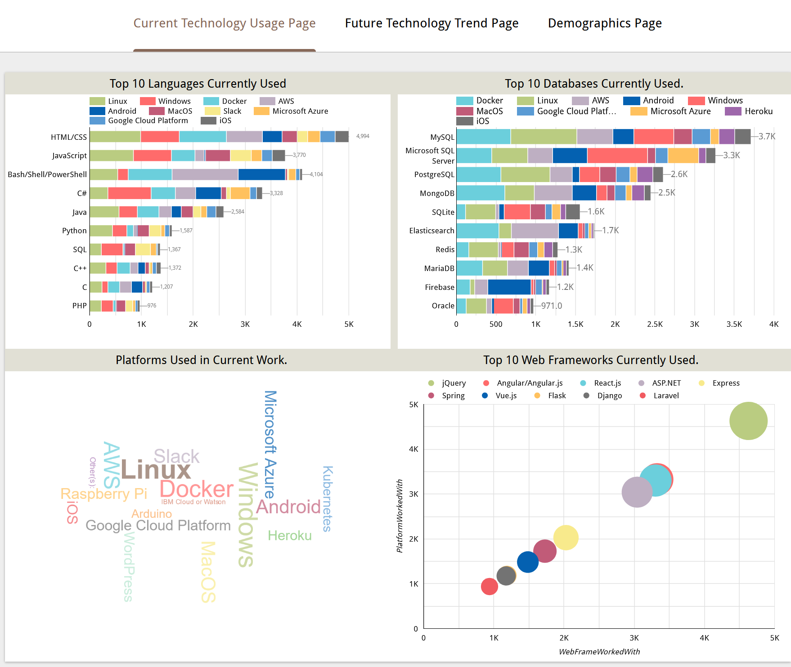
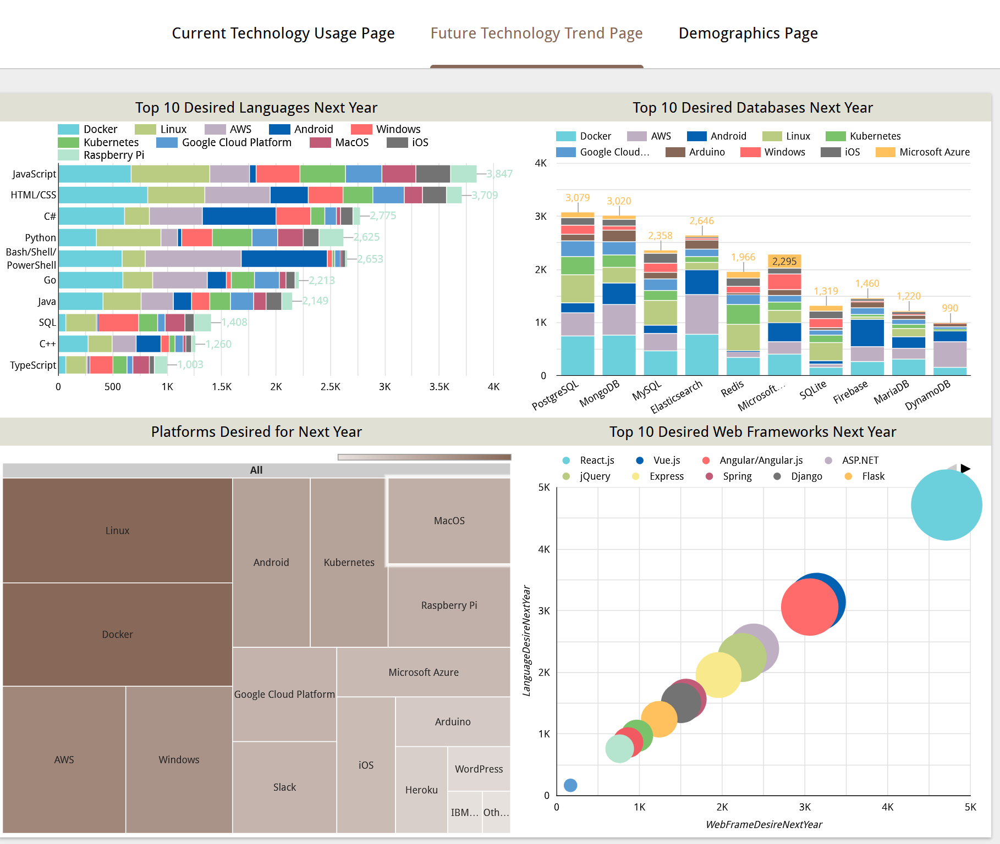
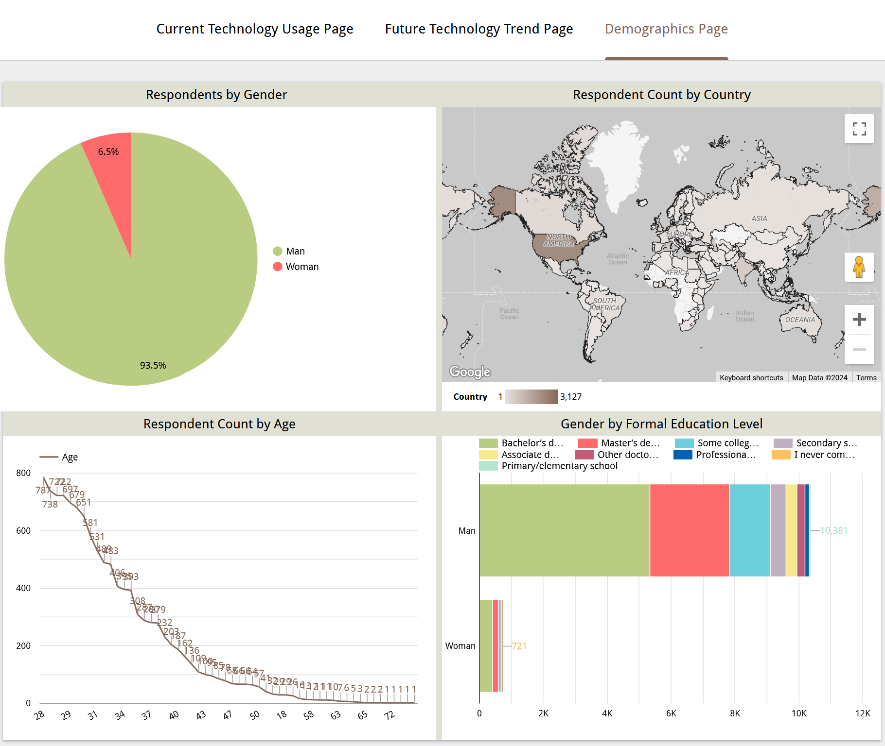

# Technology Trends and Demographics Dashboard Project

## Project Overview

This project is a Google Looker Studio dashboard designed to analyze survey data regarding current and future technology trends, as well as respondent demographics. The dashboard consists of three main pages:

1. **Current Technology Usage**
2. **Future Technology Trend**
3. **Demographics**

Each page contains multiple visualizations that present insights into language usage, database preferences, platform trends, web frameworks, and demographic breakdowns.

## Contents

- `m5_survey_data_technologies_normalised.csv`: Contains normalized survey data on technologies currently used and desired for future use.
- `m5_survey_data_demographics.csv`: Contains demographic information of survey respondents.
- `Current_Technology_Usage.png`: Screenshot of the Current Technology Usage page.
- `Future_Technology_Trend.png`: Screenshot of the Future Technology Trend page.
- `Demographics.png`: Screenshot of the Demographics page.

## Requirements

- **Google Looker Studio**: The main tool used to create and visualize data.
- **CSV Files**: Data assets (`m5_survey_data_technologies_normalised.csv` and `m5_survey_data_demographics.csv`) are required to create the visualizations.

## Setup and Configuration

1. **Upload CSV Files to Looker Studio**:
   - Open Google Looker Studio and add the provided CSV files (`m5_survey_data_technologies_normalised.csv` and `m5_survey_data_demographics.csv`) as data sources.
   
2. **Create the Dashboard Pages**:
   - Add three pages using the "2 x 2 rectangle areas tabbed" template.
   - Rename each page as follows:
     - **Page 1**: Current Technology Usage
     - **Page 2**: Future Technology Trend
     - **Page 3**: Demographics

3. **Configure Each Page**:

   ### Page 1: Current Technology Usage
   - **Panel 1**: Top 10 Languages Worked With (Stacked Bar Chart)
   - **Panel 2**: Top 10 Databases Worked With (Stacked Column Chart)
   - **Panel 3**: Platforms Worked With (Word Cloud)
   - **Panel 4**: Top 10 Web Frameworks Worked With (Scatter Bubble Chart)

   ### Page 2: Future Technology Trend
   - **Panel 1**: Top 10 Desired Languages Next Year (Stacked Bar Chart)
   - **Panel 2**: Top 10 Desired Databases Next Year (Stacked Column Chart)
   - **Panel 3**: Desired Platforms Next Year (Tree Map)
   - **Panel 4**: Top 10 Desired Web Frameworks Next Year (Scatter Bubble Chart)

   ### Page 3: Demographics
   - **Panel 1**: Respondents by Gender (Pie Chart)
   - **Panel 2**: Respondent Count by Country (Filled Map)
   - **Panel 3**: Respondent Count by Age (Line Chart)
   - **Panel 4**: Gender by Formal Education Level (Stacked Bar Chart)

4. **Apply Filters**:
   - Ensure filters are applied to exclude null or empty values in each visualization as specified.

## Usage

Once configured, the dashboard allows for interactive exploration of survey data across three categories:
- **Current Technology Usage**: Analyze which languages, databases, platforms, and web frameworks are most used.
- **Future Technology Trend**: Understand preferences for technologies respondents wish to work with next year.
- **Demographics**: View the breakdown of respondents by gender, country, age, and education level.

## Screenshots

### Current Technology Usage

### Future Technology Trend

### Demographics

### Link
The Dashboard [Google Looker Dashboard](https://lookerstudio.google.com/reporting/ec9fb4ac-7abe-4b19-98a9-9cab94b17203/page/BN7LE).
